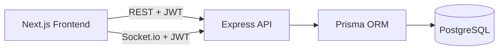

# Task Tracker

Full-stack Task Tracker application with role-based access control, real-time updates, automated tests, and CI.

## Project Structure

```
Task-Tracker/
├── backend/                   # Express + Prisma REST API + Socket.io
├── frontend/                  # Next.js UI
├── postman/                   # Postman collection & environment
├── docker-compose.yml         # Local PostgreSQL
├── render.yaml                # Render deployment blueprint
└── .github/workflows/ci.yml   # CI pipeline
```

## Prerequisites

- Node.js 20+
- npm
- Docker (recommended for local PostgreSQL)

## Environment Configuration

### Backend (`backend/.env`)

Copy the example file and adjust values:

```bash
cd backend
cp .env.example .env
```

| Variable | Description |
|----------|-------------|
| `PORT` | API port (default `4000`) |
| `DATABASE_URL` | PostgreSQL connection string |
| `JWT_SECRET` | Secret for signing JWT tokens |
| `JWT_EXPIRES_IN` | Token expiry (default `7d`) |
| `FRONTEND_URL` | Frontend origin for CORS |
| `ADMIN_EMAIL` | Optional seed admin email |
| `ADMIN_PASSWORD` | Optional seed admin password |

### Frontend (`frontend/.env.local`)

```bash
cd frontend
cp .env.example .env.local
```

| Variable | Description |
|----------|-------------|
| `NEXT_PUBLIC_API_URL` | Backend API URL (default `http://localhost:4000`) |

## Database Setup

Start PostgreSQL locally:

```bash
docker compose up -d
```

Apply schema and seed the default admin user:

```bash
cd backend
npm install
npm run db:generate
npm run db:push
npm run db:seed
```

Default admin credentials (override via `ADMIN_EMAIL` / `ADMIN_PASSWORD`):

- Email: `admin@tasktracker.com`
- Password: `admin12345`

Regular users register through the UI/API and receive the `USER` role by default.

## Backend Setup

```bash
cd backend
npm install
npm run db:generate
npm run dev
```

API runs at `http://localhost:4000`.

Health check: `GET /health`

## Frontend Setup

```bash
cd frontend
npm install
npm run dev
```

UI runs at `http://localhost:3000`.

## Architecture Overview



### Key Implementation Decisions

- **Authentication:** JWT bearer tokens issued on register/login; role stored in token payload.
- **Authorization:** RBAC enforced in the task service layer. `USER` can manage only owned tasks; `ADMIN` can view/manage all tasks and filter by owner.
- **Validation:** Zod schemas for request bodies and query parameters with consistent error responses.
- **Real-time updates:** Socket.io broadcasts task create/update/delete events to the task owner room and admin room.
- **Testing:** Supertest API tests with mocked services to keep CI fast and database-free.

## API Endpoints

| Method | Endpoint | Auth | Description |
|--------|----------|------|-------------|
| GET | `/health` | No | Health check |
| POST | `/api/auth/register` | No | Register user |
| POST | `/api/auth/login` | No | Login |
| GET | `/api/auth/me` | Yes | Current user |
| GET | `/api/tasks` | Yes | List tasks (pagination, status, owner filters) |
| POST | `/api/tasks` | Yes | Create task |
| GET | `/api/tasks/:id` | Yes | Get task by ID |
| PATCH | `/api/tasks/:id` | Yes | Update task |
| DELETE | `/api/tasks/:id` | Yes | Delete task |

### Task List Query Parameters

- `page` (default `1`)
- `limit` (default `10`, max `100`)
- `status` (`TODO`, `IN_PROGRESS`, `DONE`)
- `ownerId` (admin only)

## Postman Collection

Import these files from the `postman/` directory:

- `Task-Tracker.postman_collection.json`
- `Task-Tracker.postman_environment.json`

Workflow:

1. Run **Register** or **Login** (token is saved automatically).
2. Use task endpoints with the saved bearer token.

## Testing

```bash
# Backend
cd backend
npm test
npm run lint

# Frontend
cd frontend
npm run lint
npm run build
```

CI runs on pushes and pull requests to `main`/`master`.

## Assumptions

- Roles are assigned at registration time (`USER` by default) with a seeded admin account for review.
- Task ownership is set to the authenticated creator; admins can manage any task.
- Real-time updates are delivered via Socket.io using JWT authentication in the socket handshake.
- Due dates are stored in UTC and displayed in the user's local timezone in the UI.

## Future Improvements

- Refresh tokens and secure httpOnly cookie sessions
- Admin UI for user/role management
- Optimistic UI updates and toast notifications
- E2E tests with Playwright
- Database migrations committed to repo instead of `db push`
- Rate limiting and audit logging

## Deployment Notes

### Backend on Render.com

Use the `render.yaml` blueprint or create a **Web Service** with:

- **Root directory:** `backend`
- **Build command:** `npm install && npx prisma generate && npx prisma db push && npm run build`
- **Start command:** `node dist/index.js`

Set these environment variables in the Render dashboard:

| Variable | Example | Required |
|----------|---------|----------|
| `NODE_ENV` | `production` | Yes |
| `PORT` | `10000` | Yes (Render sets this automatically) |
| `DATABASE_URL` | `postgresql://...` | Yes (Render PostgreSQL or external DB) |
| `JWT_SECRET` | long random string | Yes |
| `JWT_EXPIRES_IN` | `7d` | Optional |
| `FRONTEND_URL` | `https://your-app.vercel.app` | Yes (CORS + Socket.io) |

After the first deploy, run the seed once (Render Shell or locally against production DB):

```bash
npm run db:seed
```

This creates the default admin account (`ADMIN_EMAIL` / `ADMIN_PASSWORD`).

### Frontend on Vercel

Import the repo and set:

- **Root directory:** `frontend`
- **Framework preset:** Next.js

| Variable | Example | Required |
|----------|---------|----------|
| `NEXT_PUBLIC_API_URL` | `https://task-tracker-backend.onrender.com` | Yes |

Use your Render backend URL (no trailing slash). This variable is used for both REST API calls and Socket.io connections.

### Deployment checklist

1. Deploy backend on Render and confirm `GET /health` returns OK.
2. Set `FRONTEND_URL` on Render to your Vercel URL.
3. Deploy frontend on Vercel with `NEXT_PUBLIC_API_URL` pointing to Render.
4. Register a user or log in with the seeded admin account.
5. Test real-time updates by opening the dashboard in two browser tabs.

- Render free tier may cold-start after idle periods (~60 seconds)

## License

MIT
